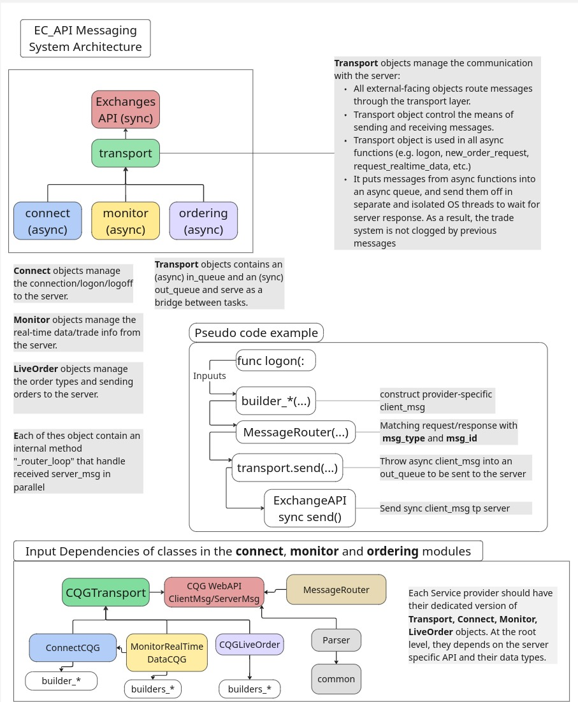
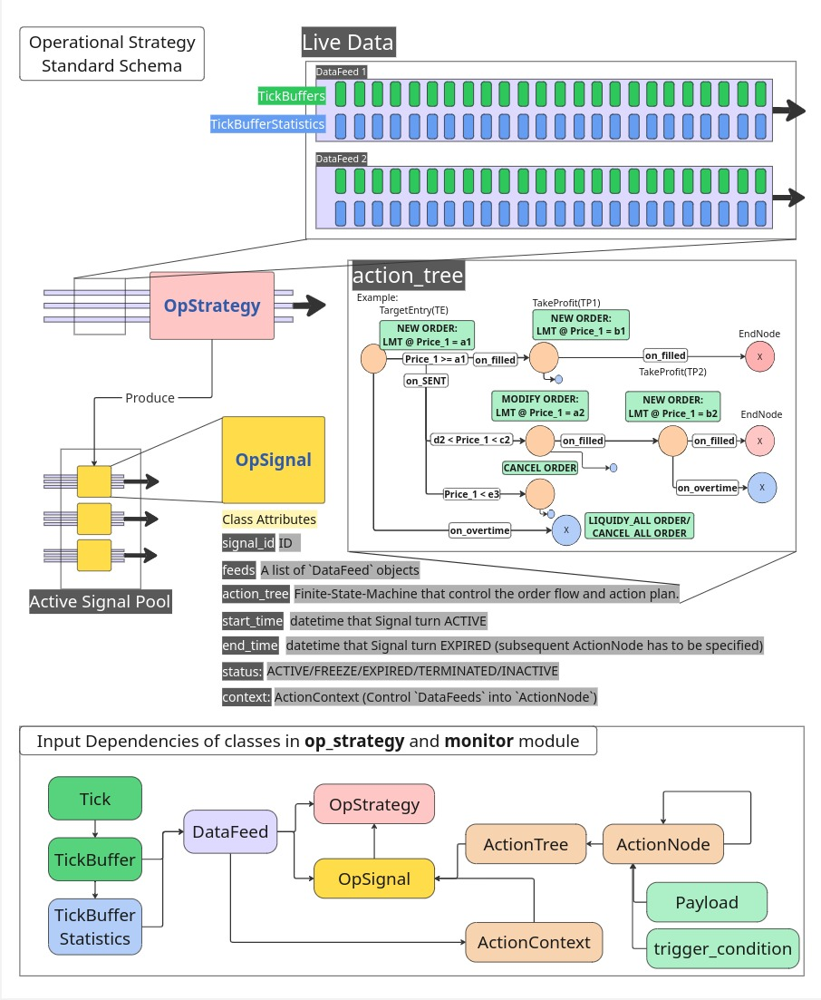

# *EC_API*: A wrapper package utilising WebSocket for Algo Trading 


## Overview
`EC_API` provides easy-to-use functions for algorithmic trading. 
It is a wrapper package that utilises Websocket messaging to facilitate 
trades, real-time data monitoring, open positions tracking, etc.

In the current version, we only support trade and real-time data monitoring 
through CQG WebAPI, which connects to their trade routing server through 
WebSocket and TSL layers. 

## Table of contents

- [Modules Review](#module-reviews)
- [Interfacing with Exchanges](#interfacing-with-exchanges)
- [Usage](#usage)
  - [Sending Orders](#sending-orders)
  - [Strategy Building](#strategy-building)
  - [Monitoring and Data Feed](#monitoring-and-data-feed)

## Module Review
`EC_API` contains the following modules:
| Module | Description |
|-----------|-------------|
| `common`  | It contains the common object schema used across the EC<br>application system, such as: `Metrics`, `DataFeed`, etc.|
| `connect` | The connection module is in charge of authentication and<br>message hear-back. |
| `ext` | External codes. Trade routing API codes are in here. |
| `monitor` | The monitor module takes care of information request, open-order<br>tracking, and real-time data request. Specify `DataFeed` input<br>for strategy here.|
| `msg_validation` | It is in charge of server message validation. After sending<br>a client request, the server response message goes through<br>message validation process in this module. The functions match<br>the message ID and map them with the acceptable message type<br>to ensure accurate pairing between client-server messages. |
| `op_strategy` | It defines the format for operational strategy (`OpStrategy`).<br> Key components for strategy building, such as `OpSignal`<br>that controls the life-cycle of signals, as well as `ActionNode`<br> and `ActionTree` (a finite-state machine) that controls<br>order flow and execution, are in this module. |
| `ordering` | It handles `LiveOrder` type objects and how we send order requests <br>to the exchanges. |
| `payload` | It contains the `Payload` class where parameter validation and<br>safety check for client message is done before sending it to the<br>server. It is recommended to conduct all trading via<br>`ExecutePayload` types of method. |
| `protocol`  | Vendor specific protocol are stored here. RPC style request-<br>response pairing and external-internal enums mappings are in this<br>module. |
| `transport` | The transport module control message routing and thread-<br>handling. Synchronous codes from vendors transition into async through<br>the `Transport` objects by separate working threads<br>for sending and receiving messages. |
| `utility` | It contains utility functions for the package.  |

## Interfacing with Exchanges
The messaging architecture follows the following:


From v0.1.0 onward, `EC_API` is designed to be async-native. All functions 
are to be awaitable.

## Usage
Here are some usage examples. 
We use the CQG connection as an example in this demonstration.


### Sending Orders
To facilitate a connection, 
```python
from EC_API.connect.cqg.connect import ConnectCQG

HOST_NAME = 'wss://demo.traderoute.com:000'
USR_NAME = 'USR_NAME'
PASSWORD = 'PASSWORD'
ACCOUNT_ID = 0000000

# create a connection before trading
CONNECT = ConnectCQG(HOST_NAME, USR_NAME, PASSWORD)
```

To send a new order request directly via `EC_API`'s native functions 
(not recommended) from the `ordering` module.

```python
from datetime import timezone, datetime, timedelta
from EC_API.ordering.cqg.live_order import CQGLiveOrder
from EC_API.ordering.enums import (
    OrderType, Duration, Side,
    ExecInstruction,
    RequestType
    )
new_order_details =  { 
    "symbol_name": "CLEV25",
    "cl_order_id": "1231314",
    "order_type": OrderType.ORDER_TYPE_LMT,  # For Limit orders
    "duration": Duration.DURATION_GTC,      # With a Duration of Good-till-Cancel
    "side": Side.SIDE_BUY,              # Buy order
    "qty_significant": 2,
    "qty_exponent": 0, 
    "scaled_limit_price": 1000,
    "good_thru_date": datetime(2025,9,9),
    "exec_instructions": ExecInstruction.EXEC_INSTRUCTION_AON
    }
                      
try:
  CLOrder1 = CQGLiveOrder(CONNECT, 
                         symbol_name = new_order_details['symbol_name'], 
                         request_id = 100, 
                         account_id = ACCOUNT_ID)
  # Specify the request type as you send the order
  CLOrder1.send(request_type = RequestType.NEW_ORDER, 
                request_details = new_order_details)  
```

To send a `modify_order` request in a similar fashion
```python

modify_order_details =  { 
    "symbol_name": "CLEV25",
    "ogri_cl_order_id": "1231314", # The original cl_order_id
    "cl_order_id": "1231315", # new cl_order_id
    "duration": Duration.DURATION_GTD, # Change from GTC to GTD
    "qty": 10, # change qty from 2 to 10
    "scaled_limit_price": 1100, # change LMT price from 1000 to 1100
    }
                      
try:
  CLOrder2 = CQGLiveOrder(CONNECT, 
                         symbol_name = modify_order_details['symbol_name'], 
                         request_id =102, 
                         account_id = ACCOUNT_ID)
  CLOrder2.send(request_type = RequestType.MODIFY.ORDER, 
                request_details = modify_order_details)

```

However, it is recommended to send order requests to the exchange  
servers using a `Payload` object. The payload class provided format
checking and safety regulation for the input parameters. 

To send orders with `Payload`, you can use this:

```python 
from EC_API.payload.base import Payload, ExecutePayload
from EC_API.payload.cqg.safety import CQGFormatCheck # Import safety standard specific to cqg
from EC_API.ordering.enums import (
    OrderType, Duration, Side,
    ExecInstruction,
    RequestType
    )
from EC_API.ordering.cqg.live_order import CQGLiverOrder
ORDER_INFO = {
   "symbol_name": "CLEV25",
   "cl_order_id": "1231314",
   "order_type": OrderType.ORDER_TYPE_LMT, 
   "duration": Duration.DURATION_GTC, 
   "side": Side.SIDE_BUY,
   "qty_significant": 2,
   "qty_exponent": 0, 
   "is_manual": False,
   "scaled_limit_price": 1000,
   "good_thru_date": datetime(2025,9,9),
   "exec_instructions": ExecInstruction.EXEC_INSTRUCTION_AON
    }

# Construct Payload object
PL1 = Payload(
  request_id = 100,
  status = PayloadStatus.PENDING,
  order_request_type = RequestType.NEW_ORDER,
  start_time = datetime.now(timezone.utc) +\
               timedelta(minutes=5)
  end_time = datetime.now(timezone.utc) +\
             timedelta(days=1)
  order_info = ORDER_INFO,
  check_method = CQGFormatCheck # Setup the format checking policy
  )

# ExecutePayload 
try: # Specify the type of live order we are using here.
  EP = ExecutePayload(CONNECT, PL1, ACCOUNT_ID, live_order=CQGLiveOrder).unload()

```
### Strategy Building
`EC_API` follows the following standard schema for operational strategy:



To build a Operational Strategy, One need to use the following workflow and data structure.

We will follow the schematic above.
First, we specify the trigger conditions and `Payload` objects to be sent.
```python
from datetime import datetime, timedelta, timezone
from EC_API.op_strategy.action import ActionNode, ActionTree
from EC_API.op_strategy.signal import OpSignal
from EC_API.payload.cqg.safety import CQGFormatCheck
from EC_API.payload.base import Payload
from EC_API.payload.enums import PayloadStatus
from EC_API.ordering.enums import RequestType

# Global variables
account_id = 1000
checks = CQGFormatCheck #Define checking schema for Payloads

# Trigger Conditions
price_a, price_b, price_c, price_d, price_a2 = 100, 50, 60, 70, 80
TE_trigger =  lambda ctx: ctx.feeds['Asset_A'].tick_buffer.ohlc()['Close'] >= price_a
mod_TE_trigger = lambda ctx: price_b < ctx.feeds['Asset_A'].tick_buffer.ohlc()['Close']  < price_c
TP_trigger_1 = lambda ctx: ctx.feeds['Asset_A'].tick_buffer.ohlc()['Close']  <= price_c
TP_trigger_2 = lambda ctx: ctx.feeds['Asset_A'].tick_buffer.ohlc()['Close']  <= price_d
cancel_trigger = lambda ctx: ctx.feeds['Asset_A'].tick_buffer.ohlc()['Close'] < price_b
overtime_cond = lambda ctx: ctx.feeds['Asset_A'].tick_buffer.buffers[timeframe][-1].timestamp >= (datetime.now(tz=timezone.utc) + timedelta(seconds=5)).timestamp()

# Define Payloads for asset A
TE_PL_A = Payload(  
    account_id=ACCOUNT_ID,
    request_id=101,
    status = PayloadStatus.PENDING,
    order_request_type = RequestType.NEW_ORDER,
    start_time = datetime.now(timezone.utc) +\
                 timedelta(minutes=5),
    end_time = datetime.now(timezone.utc) +\
               timedelta(days=1),
    order_info = {
        "symbol_name": "Asset_A",
        "cl_order_id": "1231314",
        "order_type": OrderType.ORDER_TYPE_LMT, 
        "duration": Duration.DURATION_GTC, 
        "side": Side.SIDE_SELL,
        "qty_significant": 2,
        "qty_exponent": 0, 
        "is_manual": False,
        "scaled_limit_price": 100,
        "good_thru_date": datetime(2025,9,9),
        "exec_instructions": ExecInstruction.EXEC_INSTRUCTION_AON
        },
    check_method = checks
    )
TE_mod_PL_A = Payload(
    account_id=ACCOUNT_ID,
    request_id=102,
    status = PayloadStatus.PENDING,
    order_request_type = RequestType.MODIFY_ORDER,
    start_time = datetime.now(timezone.utc) +\
                 timedelta(minutes=5),
    end_time = datetime.now(timezone.utc) +\
               timedelta(days=1),
    order_info = {
        "symbol_name": "Asset_A",
        "orig_cl_order_id" : "1231314",
        "cl_order_id" : "1231315",
        "scaled_limit_price": 80, 
        },
    check_method = checks
    )
TP_PL1_A = Payload(
    account_id=ACCOUNT_ID,
    request_id=103,
    status = PayloadStatus.PENDING,
    order_request_type = RequestType.NEW_ORDER,
    start_time = datetime.now(timezone.utc) +\
                 timedelta(minutes=5),
    end_time = datetime.now(timezone.utc) +\
               timedelta(days=1),
    order_info = {
        "symbol_name": "Asset_A",
        "cl_order_id": "1231314",
        "order_type": OrderType.ORDER_TYPE_LMT, 
        "side": Side.SIDE_BUY,
        "qty_significant": 2,
        "scaled_limit_price": 60,
        },
    check_method = checks
    )
TP_PL2_A = Payload(
    account_id=ACCOUNT_ID,
    request_id=104,
    status = PayloadStatus.PENDING,
    order_request_type = RequestType.NEW_ORDER,
    start_time = datetime.now(timezone.utc) +\
                 timedelta(minutes=5),
    end_time = datetime.now(timezone.utc) +\
               timedelta(days=1),
    order_info = {
        "symbol_name": "Asset_A",
        "cl_order_id": "1231314",
        "order_type": OrderType.ORDER_TYPE_LMT, 
        "side": Side.SIDE_BUY,
        "qty_significant": 2,
        "scaled_limit_price": 70,
        },
    check_method = checks
    )
cancel_PL_A = Payload(
    account_id=ACCOUNT_ID,
    request_id=105,
    status = PayloadStatus.PENDING,
    order_request_type = RequestType.CANCEL_ORDER,
    start_time = datetime.now(timezone.utc) +\
                 timedelta(minutes=5),
    end_time = datetime.now(timezone.utc) +\
               timedelta(days=1),
    order_info = {
        "symbol_name": "Asset_A",
        "orig_cl_order_id": "1231314", 
        "cl_order_id": "1231315",
        },
    check_method = checks
    )
overtime_PL_A = Payload(
    account_id=ACCOUNT_ID,
    request_id=106,
    status = PayloadStatus.PENDING,
    order_request_type = RequestType.LIQUIDATEALL_ORDER,
    start_time = datetime.now(timezone.utc) +\
                 timedelta(minutes=5),
    end_time = datetime.now(timezone.utc) +\
               timedelta(days=1),
    order_info = {
        "symbol_name": "Asset_A",
        },
    check_method = checks
    )

```
After that we have to define `ActionNode` and `ActionTree`. The `ActionTree` is 
better built from bottom-up (End Nodes come first, Root node come last):
```python
# Define Action Nodes
cancel_node = ActionNode("CancelEntry", 
                         payloads = [cancel_PL_A], 
                         trigger_cond = cancel_trigger, 
                         transitions={}) # End Node
TP_node_1 = ActionNode("TakeProfit1", 
                       payloads=[TP_PL1_A], 
                       trigger_cond = TP_trigger_1, 
                       transitions={}) # End Node
TP_node_2 = ActionNode("TakeProfit2", 
                       payloads =[TP_PL2_A], 
                       trigger_cond = TP_trigger_2, 
                       transitions={}) # End Node
TE_node_mod = ActionNode("ModifyTargetEntry", 
                         payloads=[TE_mod_PL_A], 
                         trigger_cond = mod_TE_trigger, 
                         transitions={
                             "TakeProfit2": (TP_trigger_2, TP_node_2)
                             }) 
TE_node = ActionNode("TargetEntry", 
                     payloads=[TE_PL_A], # Have two assets for testing. Same direction
                     trigger_cond = TE_trigger, 
                     transitions = { # Same transition and trigger conditions
                         "TakeProfit1": (TP_trigger_1, TP_node_1),
                         "ModifyTargetEntry": (mod_TE_trigger, TE_node_mod),
                         "CancelEntry": (cancel_trigger, cancel_node)   
                         }) # root node
overtime_node = ActionNode("OvertimeExit", 
                           payloads=[overtime_PL_A], 
                           trigger_cond=overtime_cond, 
                           transitions={}) # End_node, overtime condition

# Note that in this example, we do not include Database Configuration
# 

# Define Action Tree
tree = ActionTree(TE_node, overtime_cond, overtime_node)

```
Then, we have to define the `OpSignal` (Operation Signal) objects where the `ActionTree` lives:
```python
OPS = OpSignal(...
        )

```

Finally, we can write the `OpStrategy` type class that produces  `OpSignal`.
```python

```
Note that for a fully automated Algo-Trading setup, both the `OpSignal` and `OpStrategy`
live in the "Data Loop" where the raw market data from the websocket is
ingested. The raw ticks have to be stored in `TickBuffer` objects via the 
built-in method of the `DataFeed` class. `OpSignal` and `OpStrategy` interact 
with `DataFeed` and decide when to send out the corresponding orders or what 
signal to generate, respectively.

As a short summary, each class are in control of a separate function, from
a top-to-down perspective, we have:
1. `OpStrategy` reads the `DataFeed`, controls the production `OpSignal` and 
    the cool-down mechanism that limits the frequency of signal production;
2. `OpSignal` reads the `DataFeed` and controls xxx;
3. `ActionTree` controls the traversal along the `ActionNode` chain and the
    sequence of execution of the `ActionNode` objects;
4. `ActionNode` controls when the `Payload` insertion is triggered;
5. `Payload` controls how the desired orders are sent to an Exchange (`LiveOrder`
    type objects), and what format checking policy (via `FormatCheck` type 
    objects) is used to validate our orders.


### Monitoring and Data Feed
To monitor Open Orders in your account,
```python
from EC_API.monitor.cqg.trade_info import MonitorTradeCQG

# Check open orders for the past 9 hours
to_date = datetime.now(timezone.utc) - timedelta(hours=1)
from_date = datetime.now(timezone.utc) - timedelta(hours=10)

Mon = MonitorTradeCQG(CONNECT, ACCOUNT_ID)
Mon.request_historical_orders(from_date, to_date)

```

To monitor Real-time Data (WIP)
```python

```


## Project Structure


-----------------------
    ├── EC_API
    │   ├── connect                   <- In charge of server connections and authentication.
    │   │   ├── base.py
    │   │   ├── cqg                   <- cqg specific codes in each module. Patches and new services can be added easily.
    │   │   │   ├── connect.py                      
    │   │   │   └── __init__.py
    │   │   ├── hearback.py           <- Universal decorators functions for receiving server msg.
    │   │   └── __init__.py
    │   ├── ext                       <- External codes. The service provider's API can be added here.
    │   │   ├── common
    │   │   │   ├── decimal_pb2.py
    │   │   │   ├── __init__.py
    │   │   │   └── shared_1_pb2.py
    │   │   ├── __init__.py
    │   │   └── WebAPI                <- Generated format files from CQG WebAPI protocol buffer.
    │   │       ├── account_authorization_2_pb2.py
    │   │       ├── api_limit_2_pb2.py
    │   │       ├── economic_calendar_2_pb2.py
    │   │       ├── historical_2_pb2.py
    │   │       ├── __init__.py
    │   │       ├── instrument_definition_2_pb2.py
    │   │       ├── market_data_2_pb2.py
    │   │       ├── metadata_2_pb2.py
    │   │       ├── metadata_admin_2_pb2.py
    │   │       ├── order_2_pb2.py
    │   │       ├── otc_1_pb2.py
    │   │       ├── rules_1_pb2.py
    │   │       ├── strategy_2_pb2.py
    │   │       ├── strategy_definition_2_pb2.py
    │   │       ├── symbol_browsing_2_pb2.py
    │   │       ├── trade_routing_2_pb2.py
    │   │       ├── trading_account_2_pb2.py
    │   │       ├── trading_session_2_pb2.py
    │   │       ├── user_attribute_2_pb2.py
    │   │       ├── user_session_2_pb2.py
    │   │       ├── webapi_2_pb2.py
    │   │       ├── webapi_client.py
    │   │       └── websocket.py
    │   ├── __init__.py
    │   ├── monitor                   <- All functions related to monitoring.
    │   │   ├── base.py
    │   │   ├── cqg
    │   │   │   ├── realtime_data.py
    │   │   │   ├── trade_info.py
    │   │   │   └── __init__.py
    │   │   ├── data_feed.py
    │   │   ├── mock
    │   │   │   ├── realtime_data.py
    │   │   │   └── __init__.py
    │   │   ├── stat_metrics.py
    │   │   ├── tick.py
    │   │   ├── tick_stats.py
    │   │   ├── __init__.py
    │   ├── msg_validation            <- In charge of validating server message.
    │   │   ├── base.py
    │   │   ├── cqg
    │   │   │   ├── connect_enums.py
    │   │   │   ├── historical_enums.py
    │   │   │   ├── mapping.py        <- CQG-specific valid client-server msg mappings.
    │   │   │   ├── market_data_enums.py
    │   │   │   ├── meta_enums.py
    │   │   │   ├── trade_enums.py
    │   │   │   ├── valid_msg_check.py
    │   │   │   └── __init__.py
    │   │   ├── __init__.py
    │   ├── ops_strategy              <- In charge of operation strategy (Service Agnostic).
    │   │   ├── action.py
    │   │   ├── base.py
    │   │   ├── enums.py
    │   │   ├── signal.py
    │   │   └── __init__.py
    │   │ 
    │   ├── ordering                  <- In charge of sending orders to the exchanges.
    │   │   ├── base.py
    │   │   ├── cqg
    │   │   │   ├── live_order.py
    │   │   │   └── __init__.py
    │   │   ├── enums.py
    │   │   ├── __init__.py
    │   ├── payload                   <- Define the unified payload format for order requests (Service Agnostic).
    │   │   ├── base.py
    │   │   ├── cqg
    │   │   │   ├── safety.py         <- CQG-specific safety parameters and format checks.
    │   │   │   └── __init__.py    
    │   │   ├── enums.py
    │   │   ├── __init__.py
    │   │   └── safety.py
    │   ├── _typing.py
    │   ├── utility
    │   │   ├── base.py
    │   │   └── __init__.py
    │   └── _version.py
    ├── tests
    │   ├── ordering_cases.py
    │   ├── test_connect.py
    │   ├── test_monitor_CQG.py
    │   ├── test_msg_validation.py
    │   ├── test_ordering_CQG.py
    │   ├── test_payload_CQG.py
    │   ├── __init__.py
    ├── main.py
-----------------------
