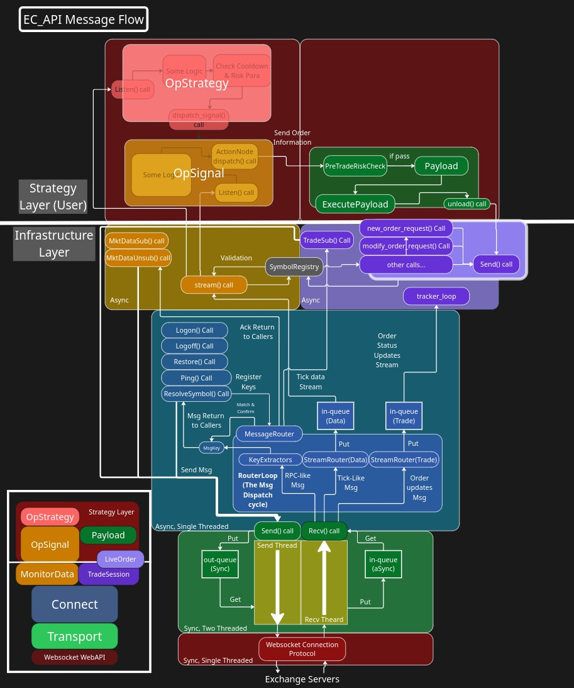
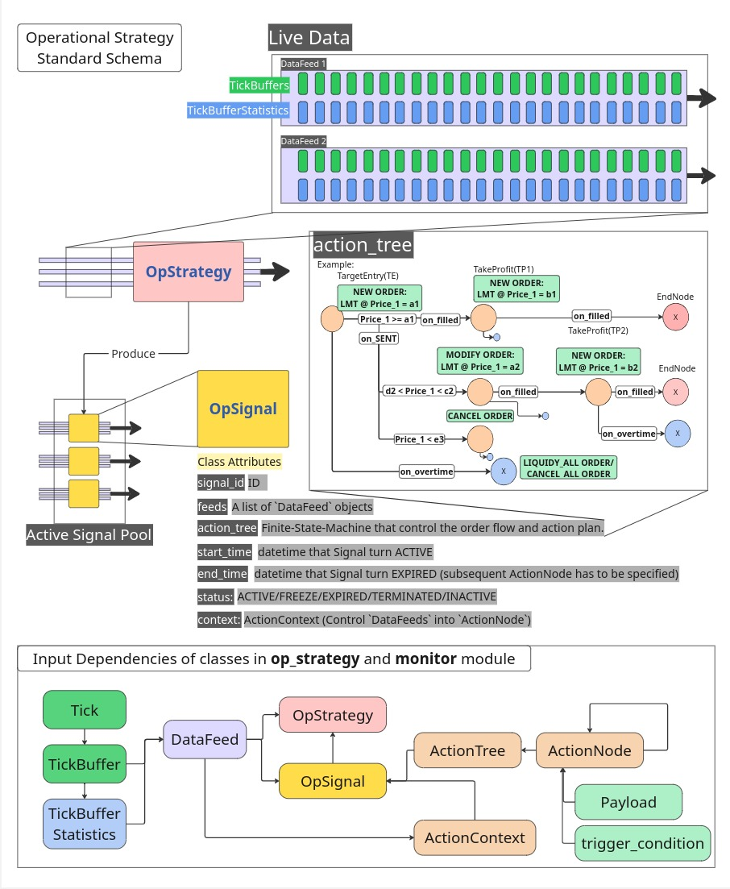

# *EC_API*: A vendor-agnostic Infrastructure and Execution Framework for Algo Trading 


[](https://codecov.io/gh/dex-hon-sci/EC_API)

## **Overview**
`EC_API` provides easy-to-use functions for algorithmic trading. 
It is a wrapper package that utilises Websocket messaging to facilitate 
trades, real-time data monitoring, open positions tracking, etc.

## **Table of contents**
- [Project Description](#project-description)
- [Installation Guide](#installation-guide)
- [Modules Review](#module-reviews)
- [Usage](#usage)
- [Interfacing with Exchanges](#Interface)
  - [Establish Connection](#connection)
  - [Sending Orders](#sending-orders)
  - [Monitoring and Data Feed](#monitoring-and-data-feed)
  - [Payload and Pre-Trade Risk Check](#risk-and-safety)
- [Strategy Building](#strategy-building)
  - [Action Node](#action-node)
  - [Action Tree](#action-tree)
  - [OpSignal](#op-signal)
  - [OpStrategy](#op-strategy)
- [Communications](#IPC)
    
## **Project Description**
`EC_API` is a trading API that handles message relays 
between client and servers. The package provides the RPC-like [^1]
function calls to communicate with service providers to
facilitate trading and market-data streaming. In addiion, we 
provide vendor-agnoistic tools in the form of strategy template to 
help users formalising and building their Algo trading strategy.

[^1]: For instance, the package exposes CQG WebAPI interactions 
as async function calls using an RPC-like request/response pattern 
over WebSocket.

Currently supported vendors:

| #  | Name | Folder Label | Protocol | Status | Docs |
|:---|:----:|:------------:|:--------:|:------:| ----:|
| 0. | Archive | `backtest` | Internal DB conncetion |  | Docs |
| 1. | CQG WebAPI | `cqg` | WebSocket TSL+protobuf message |  | Docs |


`EC_API` consists of two layers:


1. **The Infrastructure Layer**

This layer consist of the modules `transport`, `connect`, `ordering`, 
and `monitor`. Within these folders lives vendor-specific codes that routes 
messages through their respective channel and follow the rules of 
vendor-specific data format. The general architecture, however, is the
same across service providers. 

The `transport` layer handles synchronous operations of sending/receiving 
messages; the `connect` layer establish connection, manage service
 state, as well as routing server response messages from the `transport`
 layer to their respective callers asynchronously. The `MonitorData` 
(from the `monitor` module) class in the example sit on top of the
`connect` layer and handle real-time data function calls and streaming.
`TradeSession` (from the `ordering` module) establish trading
route to a service provider and allow users to send order requests via 
the `LiveOrder` objects.

2. **The Strategy/User Layer**

The user layer consists of the two module: `op_strategy` and `payload`. 
This layer is completely vendor-agnostic. 

`Payload` objects (from the `payload` module) is a simple data class 
wrapper that owns the risk-checks for the parameters of an pending order. 
Upon execution via `ExecutePayload`'s `unload()` method, it calls the 
vendor-specific `LiveOrder` to carry out the order request. 

`OpStrategy` and `OpSignal` (from the `op_strategy` modules) are 
live-objects during a trade session and both consumes real-time market data.
`OpSignal` owns the Order Management System known as the `ActionTree`. If 
a given market condition is met, it releases `Payload` to the execution system
to send orders to the server. `OpStrategy` contains useful mechanism such 
as cool-down to aid users in developing their custom strategy. One can 
inherit or inject this class into their strategy objects that runs in live
session.


## **Installation Guide**
Make sure your Python version is at least 3.12.

To install via `pip`, run this in your terminal:
```bash
pip install git+https://github.com/dex-hon-sci/EC_API

```

## **Module Review**
`EC_API` contains the following modules:
| Module | Description |
|--------|-------------|
| `channel` | Communication Channels for cross-process operation. |
| `common`  | It contains the common object schema used across the EC<br>application system, such as: `Metrics`, `DataFeed`, etc.|
| `connect` | The connection module is in charge of session state control<br> and message dispatching to the async callers. |
| `ext` | External codes. Trade routing API codes live here. |
| `monitor` | The monitor module takes care of streaming function with <br>real-time market data. |
| `op_strategy` | It defines the format for operational strategy (`OpStrategy`).<br> Key components for strategy building, such as `OpSignal`<br>that controls the life-cycle of signals, as well as `ActionNode`<br> and `ActionTree` (a finite-state machine) that controls<br>order flow and execution, are in this module. |
| `ordering` | It handles `LiveOrder` type objects and how we send order requests <br>to the exchanges. |
| `payload` | It contains the `Payload` class where parameter validation and<br>safety check for client message is done before sending it to the<br>server. It is recommended to conduct all trading via<br>`ExecutePayload` types of method. |
| `protocol`  | Vendor specific protocol are stored here. RPC style request-<br>response pairing and external-internal enums mappings are in this<br>module. |
| `transport` | The transport module control message routing and thread-<br>handling. Synchronous codes from vendors transition into async through<br>the `Transport` objects by separate working threads<br>for sending and receiving messages. |
| `utility` | It contains utility functions for the package. |


## **Usage**
Here are some usage examples. 
We use the CQG connection as an example in this demonstration.

### **Interfacing with Exchanges**

#### **Establish Connection**
To establish a connection and start running:
```python
import asyncio
from EC_API.connect.cqg.connect import ConnectCQG

HOST_NAME = 'wss://demo.traderoute.com:000'
USR_NAME = 'USR_NAME'
PASSWORD = 'PASSWORD'
ACCOUNT_ID = 0000000

# create a connection before trading

async def main():
    conn = ConnectCQG(HOST_NAME, USR_NAME, PASSWORD, ACCOUNT_ID)
    conn.start()
    # ...Do Something...
    await conn.stop() # Note that stop() is async but start() is sync
    
asyncio.run(main())
```
The `Connect` objects manages message dispatch and communication to 
vendor's server. The recommended way to start/stop the service is via
and async context manager. Alternatively, you may also start/stop the 
service through `conn.start()` and `conn.stop()` function calls, respectively.

#### **Monitoring and Data Feed**
To stream real-time market Data:
```python
from EC_API.monitor.cqg.realtime import MonitorDataCQG
from EC_API.monitor.enums import MktDataSubLevel

async with MonitorDataCQG(conn) as MD:
    # level parameter control the level of details in market data received
    async for data in MD.stream('EQ', level = MktDataSubLevel.LEVEL_TRADES_BBA):
        print(data)
 
```
While different vendors would have a different data schema, we unify the 
market data in to the same format of `ParsedRTMD`. It is a the form of 
a 4-`tuple` with each entry containing a list of market data. For example,
in the case of CQG, we have:
```python
ParsedRTMDCQG = tuple[
    list[QuotesValueTypeCQG], 
    list[MarketValueTypeCQG], 
    list[DOMValueTypeCQG],
    list[QuotesValueTypeCQG] # corrections field
    ]
```
where `QuotesValueTypeCQG`, `MarketValueTypeCQG` are also `tuple`s.
For detail description of the field indexing, please refer to either 
`_typing.py` file or the internal documentation.

#### **Trade Session and Live Orders**
To handle trade session and send orders to the exchanges, you need to
use establish a `TradeSession` object and operate within the context code 
block. Requests related to the trade account, such as order request, tracking
position statuses or account summaries should be done in a`TradeSession`.
Note that RPC-like function calls for orders belong to the `LiveOrder` objects
while trade subscriptions calls belongs to the `TradeSession` objects.

To send a new order request directly via `EC_API`'s native functions 
(not recommended) from the `ordering` module.

```python
from datetime import timezone, datetime, timedelta
from EC_API.ordering.cqg.trade_session import TradeSessionCQG
from EC_API.ordering.cqg.live_order import LiveOrderCQG
from EC_API.ordering.enums import (
    OrderType, Duration, Side,
    ExecInstruction,
    RequestType
    )
ORDER_INFO =  { 
    "symbol_name": "CLEV25",
    "cl_order_id": "1231314",
    "order_type": OrderType.ORDER_TYPE_LMT,  # For Limit orders
    "duration": Duration.DURATION_GTC,      # With a Duration of Good-till-Cancel
    "side": Side.SIDE_BUY,              # Buy order
    "qty": 2,
    "limit_price": 100,
    "good_thru_date": datetime(2025,9,9),
    "exec_instructions": ExecInstruction.EXEC_INSTRUCTION_AON
    }
                      
async with TradeSessionCQG(conn) as TS:
    await TS.trade_subscription_request(sub_id=1, sub_scope = SubScope.ORDERS)
    # Note that you need to resolve the symbol before trading
    await TS.resolve_symbol("CLEV25") 
    await LiveOrderCQG(TS).send(
        request_type = RequestType.NEW_ORDER, 
        request_details = ORDER_INFO
        )  
```
#### **Payload and Safety Parameters**
However, it is recommended to send order requests via a `Payload` object. 
It is a vendor-agnostic dataclass that conduct safety checks upon creation.

We allow for a two-stage risk check: (1) pre-trade risk check that the user 
provided in the form of a static toml file, and (2) in-session risk check 
updated based on the session information. 

Here is the format for static toml file for pre-trade check:
```toml
[global_limits]
qty_max = 10

[aliases]
CLEV25  = "CL_GENERIC"

[symbol_limits.CL_GENERIC]
price_max = 120.0
price_min = 70.0
```
To send orders with `Payload`, you can do the following:
```python 
from EC_API.payload.base import Payload, ExecutePayload
from EC_API.payload.cqg.safety import PreTradeRiskCheck

# Load the pre-trade risk check
PREC = PreTradeRiskCheck('cqg')
PREC.load("risk_para.toml")

# Construct Payload object
PL1 = Payload(
  order_request_type = RequestType.NEW_ORDER,
  order_info = ORDER_INFO,
  check_method = PREC # Static risk check done upon creation
  )

async with TradeSessionCQG(conn) as TS:
    await TS.trade_subscription_request(sub_id=1, sub_scope = SubScope.ORDERS)
    await TS.resolve_symbol("CLEV25") 
    await ExecutePayload(PL1, live_order=LiveOrderCQG(TS)).unload()
    
```

### **Strategy Building (WIP)**
`EC_API` provide useful templates: `OpStrategy` and `OpSignal` 
classes to aid writing your custom strategy logics by standardising common 
utilities such as cool-down mechanism and data ingestion.

Note that for a fully automated Algo-Trading setup, both the `OpSignal` and 
`OpStrategy` live in the "Data Loop" where the raw market data from the 
websocket is ingested. The raw ticks have to be stored in `TickBuffer` objects 
via the  built-in method of the `DataFeed` class. `OpSignal` and `OpStrategy` interact 
with `DataFeed` and decide when to send out the corresponding orders or what 
signal to generate, respectively.

As a short summary, each class are in control of a separate function, from
a top-to-down perspective, we have:
1. `OpStrategy` reads the `DataFeed`, controls the production `OpSignal` and 
    the cool-down mechanism that limits the frequency of signal production;
2. `OpSignal` reads the `DataFeed` and controls xxx;
3. `ActionTree` controls the traversal along the `ActionNode` chain and the
    sequence of execution of the `ActionNode` objects;
4. `ActionNode` controls when the execution is triggered and sent to the trade 
    engine;

To illustrate the workflow, we can look at the following example that shows
the schema of our operational strategy format.


#### Action Node
First, we specify the trigger conditions and instructions to carry out orders.
```python
from datetime import datetime, timedelta, timezone
from EC_API.op_strategy.action import ActionNode, ActionTree
from EC_API.op_strategy.signal import OpSignal
from EC_API.ordering.enums import RequestType

# Global variables

# Trigger Conditions
price_a, price_b, price_c, price_d, price_a2 = 100, 50, 60, 70, 80
TE_trigger =  lambda ctx: ctx.feeds['Asset_A'].tick_buffer.ohlc()['Close'] >= price_a
mod_TE_trigger = lambda ctx: price_b < ctx.feeds['Asset_A'].tick_buffer.ohlc()['Close']  < price_c
TP_trigger_1 = lambda ctx: ctx.feeds['Asset_A'].tick_buffer.ohlc()['Close']  <= price_c
TP_trigger_2 = lambda ctx: ctx.feeds['Asset_A'].tick_buffer.ohlc()['Close']  <= price_d
cancel_trigger = lambda ctx: ctx.feeds['Asset_A'].tick_buffer.ohlc()['Close'] < price_b
overtime_cond = lambda ctx: ctx.feeds['Asset_A'].tick_buffer.buffers[timeframe][-1].timestamp >= (datetime.now(tz=timezone.utc) + timedelta(seconds=5)).timestamp()

# ActionNodes take in a 2-tuple as instruction: (request_type, order_info)
TE_PL_A = (  
    RequestType.NEW_ORDER,
    {
        "symbol_name": "Asset_A",
        "cl_order_id": "1231314",
        "order_type": OrderType.ORDER_TYPE_LMT, 
        "duration": Duration.DURATION_GTC, 
        "side": Side.SIDE_SELL,
        "qty_significant": 2,
        "qty_exponent": 0, 
        "is_manual": False,
        "scaled_limit_price": 100,
        "good_thru_date": datetime(2025,9,9),
        "exec_instructions": ExecInstruction.EXEC_INSTRUCTION_AON
        })
TE_mod_PL_A = (
    RequestType.MODIFY_ORDER,
    {
        "symbol_name": "Asset_A",
        "orig_cl_order_id" : "1231314",
        "cl_order_id" : "1231315",
        "scaled_limit_price": 80, 
        })
TP_PL1_A = (
    RequestType.NEW_ORDER,
    {
        "symbol_name": "Asset_A",
        "cl_order_id": "1231314",
        "order_type": OrderType.ORDER_TYPE_LMT, 
        "side": Side.SIDE_BUY,
        "qty_significant": 2,
        "scaled_limit_price": 60,
        })
TP_PL2_A = (
    RequestType.NEW_ORDER,
    {
        "symbol_name": "Asset_A",
        "cl_order_id": "1231314",
        "order_type": OrderType.ORDER_TYPE_LMT, 
        "side": Side.SIDE_BUY,
        "qty_significant": 2,
        "scaled_limit_price": 70,
        })
cancel_PL_A = (
    RequestType.CANCEL_ORDER,
    {
        "symbol_name": "Asset_A",
        "orig_cl_order_id": "1231314", 
        "cl_order_id": "1231315",
    })   
overtime_PL_A = (
    RequestType.LIQUIDATEALL_ORDER,
    {
        "symbol_name": "Asset_A",
    })

```
After that we have to define `ActionNode` and `ActionTree`. The `ActionTree` is 
better built from bottom-up (End Nodes come first, Root node come last):
```python
# Define Action Nodes
cancel_node = ActionNode(
            "CancelEntry", 
            payloads = [cancel_PL_A], 
            trigger_cond = cancel_trigger, 
            transitions={}
            ) # End Node
TP_node_1 = ActionNode(
            "TakeProfit1", 
            payloads=[TP_PL1_A], 
            trigger_cond = TP_trigger_1, 
            transitions={}
            ) # End Node
TP_node_2 = ActionNode(
            "TakeProfit2", 
            payloads =[TP_PL2_A], 
            trigger_cond = TP_trigger_2, 
            transitions={}
            ) # End Node
TE_node_mod = ActionNode(
            "ModifyTargetEntry", 
            payloads=[TE_mod_PL_A], 
            trigger_cond = mod_TE_trigger, 
            transitions={
                "TakeProfit2": (TP_trigger_2, TP_node_2)
            }) 
TE_node = ActionNode(
            "TargetEntry", 
            payloads=[TE_PL_A], # Have two assets for testing. Same direction
            trigger_cond = TE_trigger, 
            transitions = { # Same transition and trigger conditions
                "TakeProfit1": (TP_trigger_1, TP_node_1),
                "ModifyTargetEntry": (mod_TE_trigger, TE_node_mod),
                "CancelEntry": (cancel_trigger, cancel_node)   
            }) # root node
overtime_node = ActionNode(
            "OvertimeExit", 
            payloads=[overtime_PL_A], 
            trigger_cond=overtime_cond, 
            transitions={}
            ) # End_node, overtime condition

# Define Action Tree
tree = ActionTree(TE_node, overtime_cond, overtime_node)

```
Then, we have to define the `OpSignal` (Operation Signal) objects where 
the `ActionTree` lives:
```python
OPS = OpSignal(...
        )

```

Finally, we can write the `OpStrategy` type class that produces `OpSignal`.
```python


```
